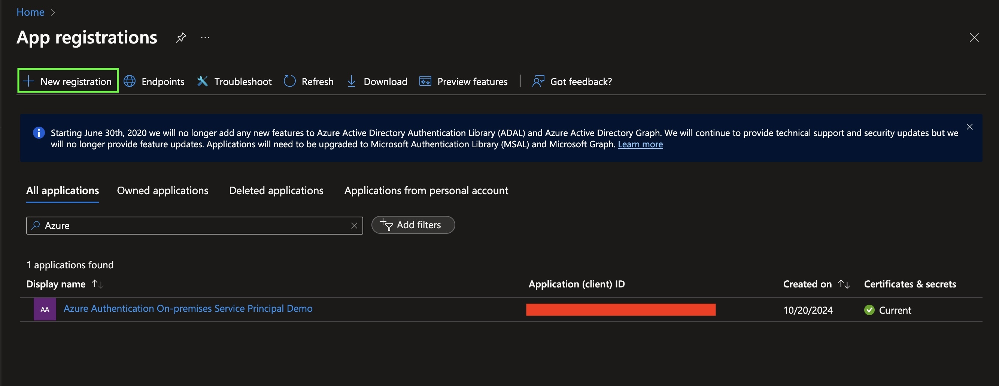
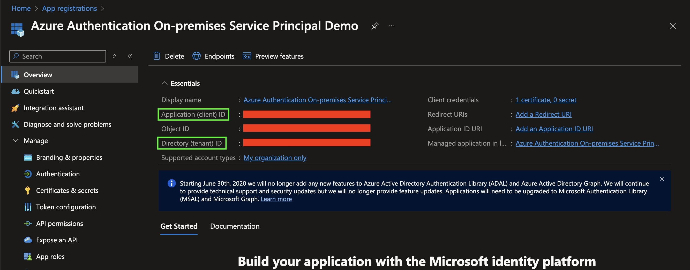
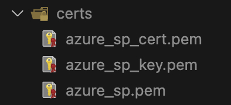
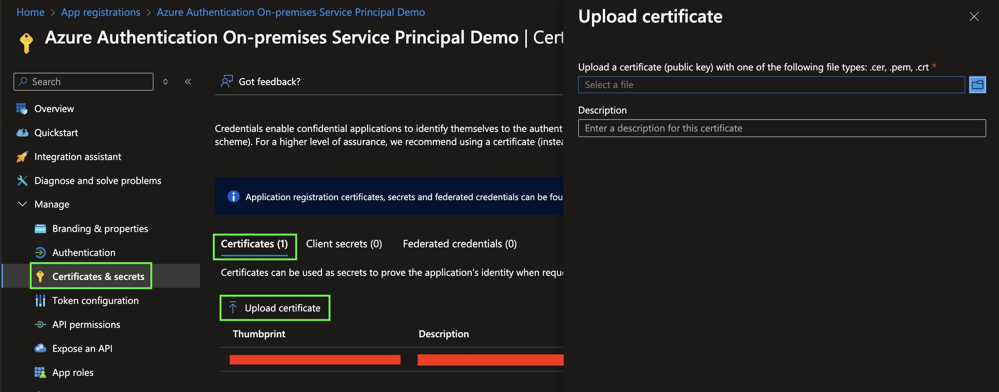
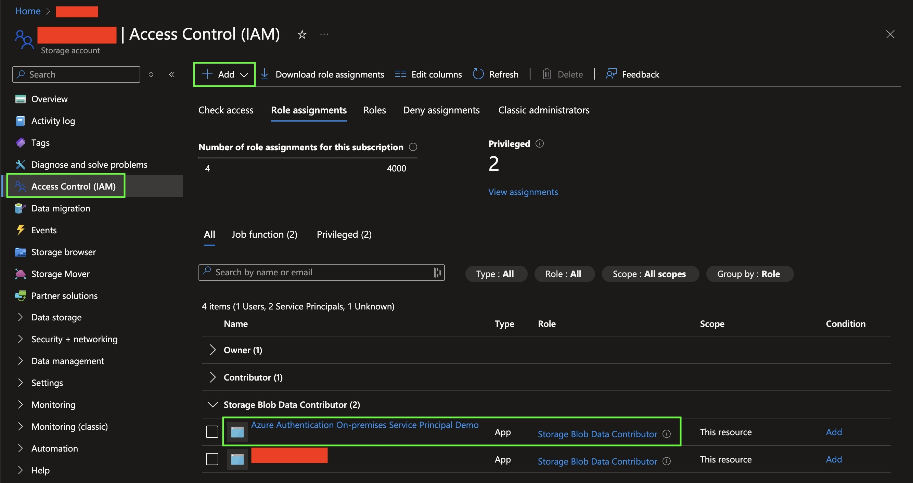
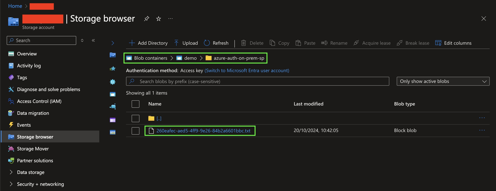

# Azure Authentication / On-premises Service Principal

A short guide on how to use Azure authentication for applications hosted on-premises using service principals.

The sample app uses certificate-based authentication, but it's also possible to use secret-based approach.

In this guide, the sample app is running in containerized environment,
which requires us to mount the certificate to the app container.

## Prerequisites

- Azure Subscription with a Storage Account
- OpenSSL for `openssl` CLI tool
- Node.js for the sample app built with TypeScript
- Docker

## Guide

**NOTE:**  
The guide uses the default directory/file paths used by the sample app!
If you want to the paths, make sure to change them everywhere they're needed.

1. Navigate to [Azure Portal](https://portal.azure.com) and validate that you have the required
   Subscription and Storage Account.

1. In Azure Portal, navigate to _"App registrations"_ and create a new registration with _"New registration"_.

    

    - You can also use an existing app registration,
      if the application you want to authenticate with already exists.

1. After the app registration creation, you should see its client ID and tenant ID.
   You'll need these later when configuring the sample app.

    

1. Run the [`create-certs.sh`](./create-certs.sh) script in the repo's root directory.
   The script will create a certificate and a private key with the `openssl` command,
   which will also ask few question required for the certificate.
   The scripts outputs should be visible under `certs/` directory.

    

    - The `openssl` questions can be skipped by populating the certificate subject with the `-subj` handle.
        - Example: `-subj "/C=FI/ST=Pirkanmaa/L=Tampere/O=My Name/CN=azure-auth-on-prem-sp"`
    - `azure_sp.pem` is combined from `azure_sp_cert.pem` and `azure_sp_key.pem`,
      which can be validated by making sure it contains both `BEGIN CERTIFICATE`
      and `BEGIN PRIVATE KEY`.

1. In the app registration, navigate to _"Certificates & secrets"_ and select the _"Certificates"_ tab.
   Click _"Upload certificate"_ and upload the `azure_sp_cert.pem` created in the previous step.

    

    - The uploaded `azure_sp_cert.pem` should ONLY contain `BEGIN CERTIFICATE` and NOT `BEGIN PRIVATE KEY`!
    - If you want to use secret-based authentication, you can create a new secret under the _"Client secrets"_ tab.

1. **At this stage, the sample app should now be able to perform authentication using
   the service principal!**
   The application does not have any role assignments,
   so it cannot yet access Azure resources because of it.

1. In Azure Portal, navigate to _"Storage accounts"_ and select the Storage Account you want to use.
   Under the Storage Account, select _"Access Control (IAM)"_ and a new role assignment to your
   application with _"Add"_ / _"Add role assignment"_.
   Make sure the role provides access to the Blob Storage (e.g. _"Storage Blob Data Contributor"_).

    

    - In this guide, we use the built-in role _"Storage Blob Data Contributor"_.
      If you want your application to have a more fine-grained role,
      you should create a new role that only has permissions that the application needs.
    - In this guide, we added the role assignment to the scope of the whole Storage Account.
      The role assignment scope can also be limited to a single container if that's desired.

1. Now it's time for the sample app to authenticate as the application we created in Azure Portal.
   Create a `.env` file, insert the following template to the file and fill in the values.

    ```
    AZURE_TENANT_ID="<Directory (tenant) ID>"
    AZURE_CLIENT_ID="<Application (client) ID>"

    # Certificate-based authentication
    # (Should match the file bind in docker-compose.yml)
    AZURE_CLIENT_CERTIFICATE_PATH="/azure_sp.pem"

    # Secret-based authentication (not used in the sample app)
    AZURE_CLIENT_SECRET=""

    STORAGE_ACCOUNT_NAME="<Storage Account Name>"
    STORAGE_BLOB_CONTAINER="<Blob container name>"
    ```

1. Run the sample app with `docker compose up`.
   The app tries to authenticate using the service principal and
   upload a single blob to the configured Blob Storage.

   The app's logs should look something like this:

    ```
    azure-auth-on-prem-sp-app-1  | Blob Storage client initialized: https://example.blob.core.windows.net/
    azure-auth-on-prem-sp-app-1  |
    azure-auth-on-prem-sp-app-1  | Sending a blob to Blob Storage - Container: demo, Name: azure-auth-on-prem-sp/260eafec-aed5-4ff9-9e26-84b2a6601bbc.txt
    azure-auth-on-prem-sp-app-1  | Success!
    azure-auth-on-prem-sp-app-1  | Shutdown
    azure-auth-on-prem-sp-app-1 exited with code 0
    ```

    - The sample app uses `DefaultAzureCredential` from `@azure/identity`,
      but under the hood the default credential uses `EnvironmentCredential`,
      which could also be used directly in the code.

1. As the result, the blob from the previous step should now be visible in the Blob Storage!

    

1. Now you can try to remove the application's role assignment and run the sample app again.
   We should notice that the sample app does not have permissions to use the Blob Storage anymore.

   The app's logs should now have the following error:

    ```
    azure-auth-on-prem-sp-app-1  | RestError: This request is not authorized to perform this operation using this permission.
    .....
    azure-auth-on-prem-sp-app-1  | {
    azure-auth-on-prem-sp-app-1  |   code: 'AuthorizationPermissionMismatch',
    azure-auth-on-prem-sp-app-1  |   statusCode: 403,
    azure-auth-on-prem-sp-app-1  |   details: {
    azure-auth-on-prem-sp-app-1  |     errorCode: 'AuthorizationPermissionMismatch',
    azure-auth-on-prem-sp-app-1  |     'content-length': '279',
    azure-auth-on-prem-sp-app-1  |     'content-type': 'application/xml',
    azure-auth-on-prem-sp-app-1  |     server: 'Windows-Azure-Blob/1.0 Microsoft-HTTPAPI/2.0',
    azure-auth-on-prem-sp-app-1  |     'x-ms-request-id': '1566a039-701e-0049-1cd6-2237c0000000',
    azure-auth-on-prem-sp-app-1  |     'x-ms-client-request-id': 'bbffddfa-ca95-4d0b-946f-d155b616682d',
    azure-auth-on-prem-sp-app-1  |     'x-ms-version': '2024-11-04',
    azure-auth-on-prem-sp-app-1  |     date: 'Sun, 20 Oct 2024 09:55:32 GMT',
    azure-auth-on-prem-sp-app-1  |     message: 'This request is not authorized to perform this operation using this permission.\n' +
    azure-auth-on-prem-sp-app-1  |       'RequestId:1566a039-701e-0049-1cd6-2237c0000000\n' +
    azure-auth-on-prem-sp-app-1  |       'Time:2024-10-20T09:55:33.5755712Z',
    azure-auth-on-prem-sp-app-1  |     code: 'AuthorizationPermissionMismatch',
    azure-auth-on-prem-sp-app-1  |     authenticationErrorDetail: undefined
    azure-auth-on-prem-sp-app-1  |   }
    azure-auth-on-prem-sp-app-1  | }
    ```
